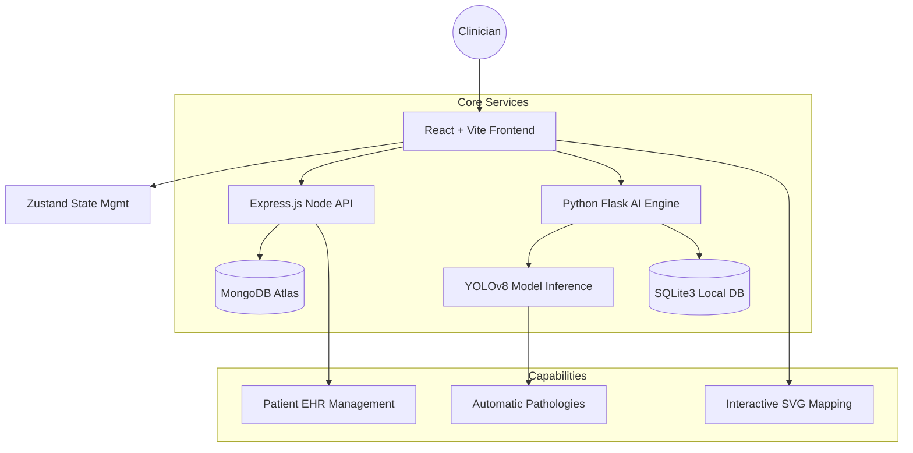

# 🦷 Dentora AI: Dental Intelligence Engine

[](https://github.com/md-bilal-d/Dentora-Ai)
[](LICENSE)
[](https://github.com/md-bilal-d/Dentora-Ai)

> **Empowering dentists with AI-driven diagnostics and interactive patient intelligence.**

---

## 🚀 The Vision
Dentistry is evolving, yet many clinicians still rely on manual annotations and fragmented patient data. **Dentora AI** bridges the gap between raw medical imaging and actionable clinical insights. By combining deep learning with a premium interactive UI, we simplify the complex diagnostic process, reducing human error and enhancing patient communication.

## ✨ Key Features

### 🤖 AI-Powered Diagnostic Engine
*   **Automated X-ray Scanning**: Uses a fine-tuned **YOLOv8** model to detect 20+ dental pathologies, including Caries, Bone Loss, Fractures, and Cysts.
*   **Real-time Inference**: Sub-second analysis of panoramic (OPG) X-rays via a dedicated Python Flask microservice.
*   **Disease Scoring**: Proprietary algorithm calculates a 0-100 severity score based on detection confidence and clinical impact.

### 📍 Interactive Tooth Pain Locator
*   **Precision Mapping**: Interactive 1-32 tooth diagram for pinpointing patient discomfort.
*   **SVG Animations**: Staggered, fluid animations that visually guide the clinician during the diagnostic workflow.
*   **Historical Tracking**: Correlates pain sites with previous treatments and AI scan findings.

### 💎 Clinical Luminosity Design System
*   **Medical Premium Aesthetic**: High-fidelity dark mode optimized for radiologic environments.
*   **Accessibility First**: High-contrast typography and intuitive navigation bars.
*   **Responsive Dashboard**: Multi-tabbed interface (General, Rx, Billing, AI Vision, Pain Locator).

---

## 🏗️ Technical Architecture

Dentora AI is built on a high-availability microservices architecture to ensure seamless scaling of AI workloads.



---

## 🛠️ Tech Stack

| Layer | Technologies |
| :--- | :--- |
| **Frontend** | React 19, Vite, TypeScript, Tailwind CSS, Framer Motion, GSAP |
| **Node API** | Node.js, Express, MongoDB Atlas, JWT Auth, Mongoose |
| **AI Engine** | Python 3.x, Flask, Ultralytics YOLOv8, OpenCV, PIL |
| **State** | Zustand, React Context |
| **Graphics** | Dynamic SVG, Lucide React, Chart.js |

---

## 🏁 Getting Started

### 📦 Prerequisites
- Node.js (v18+)
- Python (v3.10+)
- MongoDB Atlas Account

### 🚀 Running the Project
1. **Clone the repository:**
   ```bash
   git clone https://github.com/md-bilal-d/Dentora-Ai.git
   cd Dentora-Ai
   ```
2. **Install all dependencies:**
   ```bash
   npm install && cd server && npm install && cd ..
   ```
3. **Start the Integrated Development Cluster:**
   ```bash
   npm run dev:all
   ```
   *This starts the Frontend (5173), Node Backend (5001), and AI Backend (5000) concurrently.*

---

## 🏆 Hackathon Pitch
Built for speed, accuracy, and impact. Dentora AI isn't just a management tool; it's a diagnostic partner. We solved the "black box" problem of AI by providing an interactive **Pain Locator** that allows doctors to marry AI predictions with patient feedback in a single, beautiful interface.

---

**Developed with ❤️ for the Hackathon Judges.**
[md-bilal-d](https://github.com/md-bilal-d)
